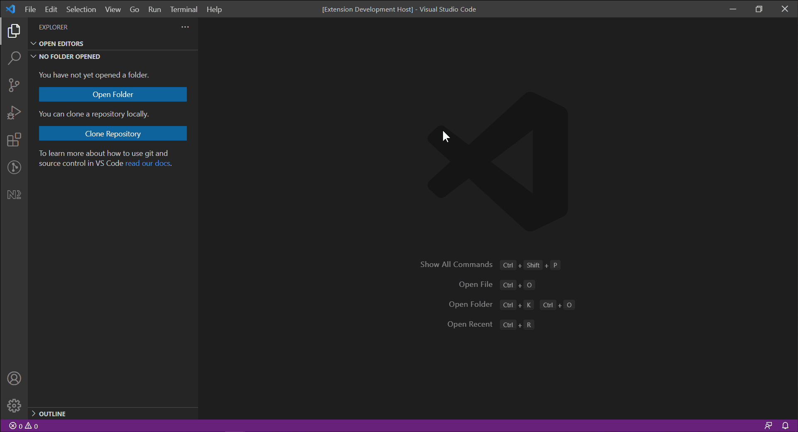

# Compare View

A simple extension to open compare view in untitled files to paste in any text to compare.

This will save you time if you are frequently open 2 new files and right-click one and select 'Select for Compare' then right-click another and select 'Compare with Selected'

## Features

<kbd>Ctrl</kbd> + <kbd>Shift</kbd> + <kbd>P</kbd>, which brings up the Command Palette, and search for Create Compare View command.

